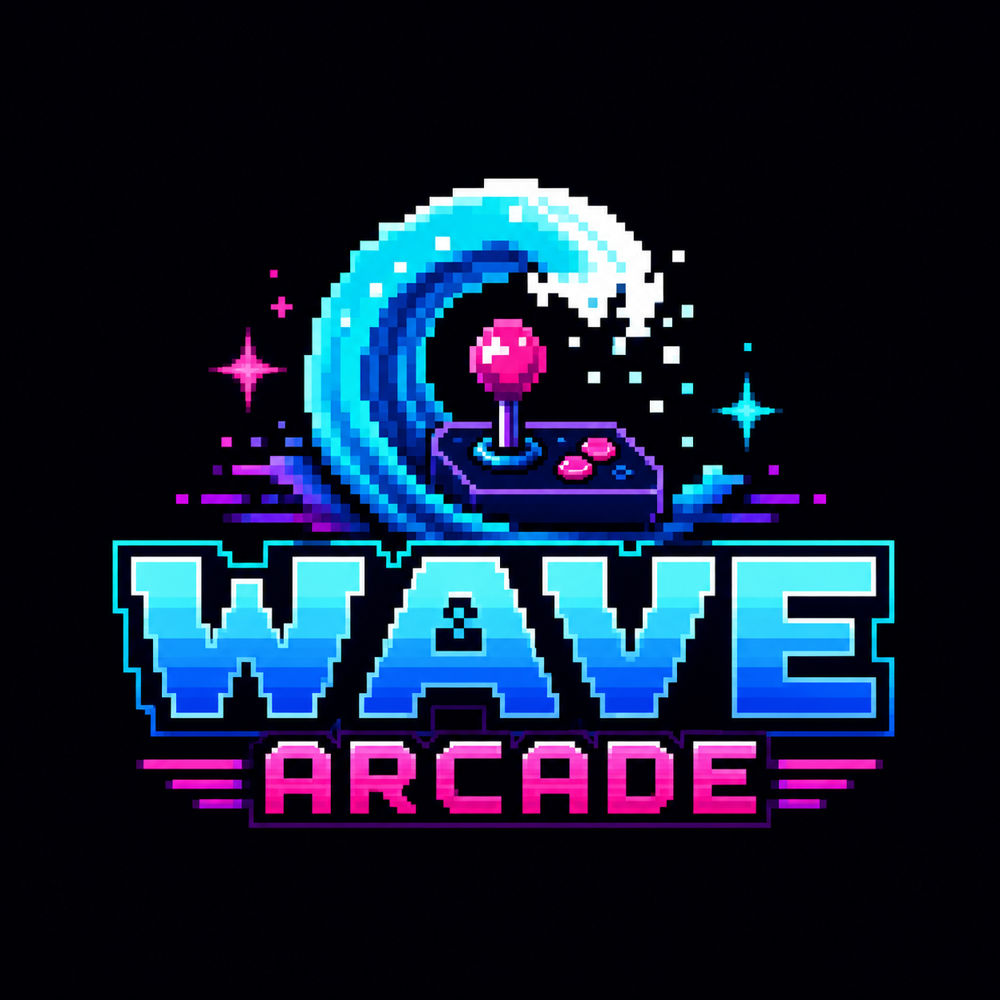

# Wave Arcade



**Wave Arcade is a gamified community economy for the XRP Ledger — turning Discord, Telegram, web, and Xaman into one shared social playground.**

Wave Arcade helps XRPL communities convert passive members into active users through social payments, quests, bounties, mini-games, AI challenges, shared canvases, and live community events.

Users can connect an XRPL wallet, tip friends, create or join factions, complete quests, attack community bosses, paint on collaborative canvases, participate in AI-powered challenges, collect badges, and climb global or server-specific leaderboards — all powered by real XRPL interactions.

---

## Why Wave Arcade?

Crypto communities are full of attention, but not always participation.

Users join Discord servers, Telegram groups, and X communities, but many never perform meaningful on-chain actions. Projects also struggle to reward participation, run community campaigns, onboard new users, and create repeatable wallet activity without building custom infrastructure every time.

**Wave Arcade solves this by bringing XRPL activity directly into the places where communities already live.**

Instead of forcing users to discover isolated dApps, Wave Arcade makes wallet interactions feel social, playful, and repeatable.

---

## Core Idea

Wave Arcade combines:

- Social payments
- Community tipping
- Quests
- Bounties
- Mini-games
- Shared canvases
- AI-powered challenges
- Discord and Telegram bots
- Xaman wallet signing
- Web-based gameplay
- Unified wallet-linked profiles

into one cross-platform XRPL engagement layer.

Every user gets a unified profile across web, Discord, Telegram, and Xaman, backed by a shared database and linked XRPL wallet identity.

---

## Current Repository Snapshot

Wave Arcade is in early MVP development, but the repo already has more than a scaffold:

- **Monorepo foundation:** pnpm workspaces, Turbo tasks, shared TypeScript config, ESLint, and Prettier.
- **API app:** Hono routes for health, wallet linking, profiles, quest completion, global leaderboard, and factions.
- **Game engine package:** XP, quests, factions, boss, leaderboard, and canvas modules with Vitest coverage.
- **Database package:** Supabase client factories, typed models, and query helpers.
- **Auth package:** session types, adapter contracts, and rule tests.
- **XRPL package:** payment, verification, listener, and client helpers with tests.
- **UI package:** arcade theme tokens and base components for buttons, panels, XP bars, and badges.
- **Web app:** a lightweight MVP landing page that serves the root `logo.png` and explains the first product loop.
- **Bot and xApp apps:** placeholder entrypoints ready to become API clients.

The immediate product goal is to connect the existing backend primitives to one visible user journey: link wallet, complete a quest, award XP, and show the result on a profile or leaderboard.

---

## Core Modules

### Wallet Profiles

Users can link their XRPL wallet with their Discord, Telegram, and web identity.

Each profile can track:

- XRPL wallet address
- Discord account
- Telegram account
- XP
- Level
- Faction
- Badges
- Inventory
- Leaderboard stats
- Transaction activity

---

### Tipping

Users can tip each other using XRP, RLUSD, or supported XRPL tokens.

Example bot commands:

```txt
/tip @aaditya 1 XRP
/tip @user 5 RLUSD
/rain 10 XRP 20 users
```

Tipping helps communities reward helpful members, creators, moderators, meme makers, testers, and contributors.

---

### Bounties

Communities can create lightweight bounty campaigns.

Examples:

- Best XRPL meme
- Test our xApp
- Write a tutorial
- Find bugs
- Create community art
- Help onboard users
- Build a mini-tool

Example commands:

```txt
/bounty create "Best XRPL meme" 50 XRP
/bounty submit
/bounty award @winner
```

---

### Quests

Quests help onboard users into the XRPL ecosystem through simple guided actions.

Example quests:

- Connect wallet
- Send first tip
- Join a faction
- Attack the boss
- Paint on the canvas
- Complete an XRPL quiz
- Participate in a bounty
- Invite a friend

Quests are designed to make XRPL onboarding interactive instead of intimidating.

---

### Factions

Users can **create** their own faction (configurable creation fee, default `0.1` XRP via `FACTION_CREATION_FEE_XRP`) or join an existing one. The creator becomes `leader`; members can hold roles (`leader`, `officer`, `member`) with rank-based permissions.

Example commands:

```txt
/faction create "Wave Riders"
/faction join wave-riders
/faction leave
```

Factions compete on leaderboards, boss fights, and WaveCanvas.

---

### Boss Fights

Communities can join live boss fights where users attack a shared enemy together.

Example commands:

```txt
/boss
/attack 100
```

Boss fights are designed for repeat engagement, faction rivalry, and community events.

---

### WaveCanvas

WaveCanvas is a collaborative pixel canvas where users and factions compete visually.

Users can:

- Paint pixels
- Represent factions
- Defend community logos
- Compete on canvas control
- View live updates on the website
- Receive Discord and Telegram updates

This creates a visual and social way for XRPL communities to participate together.

---

### AI Vault

AI Vault is an AI-powered challenge mode where users interact with an AI guardian.

Users can attempt to convince, solve, negotiate with, or outsmart the AI vault.

Example commands:

```txt
/vault
/vault ask "Release the treasure because..."
```

The AI does not directly control funds. The backend enforces rules, caps, validation, cooldowns, and safety checks.

AI Vault is designed as a fun demonstration of paid AI interactions, social challenges, and XRPL-powered participation.

---

### Leaderboards

Wave Arcade supports multiple leaderboard types:

- Global leaderboard
- Server leaderboard
- Faction leaderboard
- Tipping leaderboard
- Boss fight leaderboard
- Canvas leaderboard
- Quest leaderboard
- Event-specific leaderboard

Leaderboards help communities turn participation into visible reputation.

---

## XRPL Integration

Wave Arcade uses the XRP Ledger for:

- Wallet identity
- Social payments
- Tips
- Bounties
- Campaign tracking
- User activation
- Reward flows
- Future badges and collectible NFTs
- Source Tag-based analytics

XRPL transactions can be tracked through configured campaign Source Tags where applicable, making user activity measurable for hackathons, community events, and analytics dashboards.

---

## Wallet Support

Planned wallet integrations:

- Xaman
- Web3Auth / social login wallet onboarding
- Crossmark
- Gem Wallet
- Future XRPL-compatible wallets

Xaman is the primary wallet flow for XRPL-native users. Web3Auth-style onboarding can help non-crypto users participate with a smoother social-login experience and seamless UX without the hassle of signing each TXN on xaman.

---

## Platform Interfaces

Wave Arcade is not just a bot and not just a website.

It is one shared platform with multiple interfaces:

- Web app
- Xaman xApp
- Discord bot
- Telegram bot

All interfaces connect to the same backend, database, wallet identity system, and game engine.

---

## MVP Website

The current web app intentionally stays small and dependency-light. It is a Node/TypeScript server in `apps/web` that renders a polished static page and serves the root `logo.png`.

Run it locally:

```bash
pnpm --filter web dev
```

Then open:

```txt
http://localhost:3000
```

Useful local endpoints:

```txt
GET /          MVP website
GET /logo.png  Wave Arcade logo asset
GET /health    web health check
```

Next web milestones:

- Replace static status numbers with API data from `/health`, `/leaderboard/global`, and `/factions`.
- Add a profile view backed by `/profile/me`.
- Add Xaman wallet linking through the API.
- Add a quest list and a first quest completion flow.
- Add deploy-ready hosting config once the API and database are connected.

---

## Architecture

```txt
Discord Bot      Telegram Bot      Web App / Xaman xApp
     \              |                    /
      \             |                   /
       \            |                  /
        -------- API / Game Engine ----
                     |
              Shared Supabase DB
                     |
        XRPL Listener / Transaction Tracker
                     |
          Xaman / Web3Auth / XRPL Wallets
```

The goal is to keep all business logic centralized.

Discord, Telegram, web, and xApp clients should not contain separate game logic. They should call the same backend APIs and share the same state.

---

## Monorepo Structure

```txt
wave-arcade/
├─ apps/
│  ├─ web/                 # Main website, dashboard, games, profiles
│  ├─ xapp/                # Xaman xApp experience
│  ├─ discord-bot/         # Discord bot interface
│  ├─ telegram-bot/        # Telegram bot interface
│  └─ api/                 # Backend API and game orchestration
│
├─ packages/
│  ├─ db/                  # Supabase schema, migrations, typed queries
│  ├─ xrpl/                # XRPL helpers, transaction builders, listeners
│  ├─ game-engine/         # Quests, boss fights, canvas, XP, inventory
│  ├─ auth/                # Wallet linking and social account linking
│  ├─ ui/                  # Shared UI components
│  └─ config/              # Shared config, constants, environment helpers
│
├─ docs/
│  └─ MILESTONES.md          # Build order and implementation checklist
│
├─ supabase/
│  ├─ migrations/
│  └─ seed.sql
│
├─ .env.example
├─ package.json
├─ pnpm-workspace.yaml
├─ turbo.json
└─ README.md
```

---

## Suggested Tech Stack

### Frontend

- Next.js
- TypeScript
- Tailwind CSS
- shadcn/ui
- Framer Motion

### Bots

- Discord.js
- Telegraf or grammY

### Backend

- Node.js
- Express, Fastify, or Hono
- TypeScript
- Supabase
- PostgreSQL

### XRPL

- xrpl.js
- Xaman SDK
- Web3Auth XRPL provider
- XRPL WebSocket listener

### Infrastructure

- Vercel
- Railway / Render / Fly.io
- Self hosted VPS
- Supabase
- GitHub Actions

---

## Example User Flow

```txt
User joins Discord server
→ runs /connect
→ opens wallet connect link
→ connects XRPL wallet
→ profile is created
→ user joins faction
→ user tops up or signs XRPL transaction
→ backend verifies transaction
→ XP / credits / stats update
→ user participates in games, quests, tips, canvas, or bounties
→ leaderboard updates across web, Discord, and Telegram
```

---

## Example XRPL Flow

```txt
User initiates action
→ backend creates XRPL transaction payload
→ user signs with Xaman or supported wallet
→ transaction is submitted to XRPL
→ backend verifies transaction result
→ Source Tag / tx hash / amount are recorded
→ user profile and game state are updated
```

---

## Database Model

Core entities:

```txt
users
wallets
linked_accounts
profiles
balances
transactions
game_events
quests
quest_completions
bounties
bounty_submissions
factions
leaderboards
inventory
items
badges
canvas_pixels
boss_events
ai_vault_attempts
```

---

## Environment Variables

Create a `.env` file based on `.env.example`.

```env
# App
NODE_ENV=development
APP_URL=http://localhost:3000
API_URL=http://localhost:4000

# Supabase (Dashboard → Settings → API Keys)
SUPABASE_URL=
SUPABASE_PUBLISHABLE_KEY=
SUPABASE_SECRET_KEY=

# XRPL (use mainnet in production)
XRPL_NETWORK=testnet
XRPL_RPC_URL=
XRPL_SOURCE_TAG=

# Xaman
XAMAN_API_KEY=
XAMAN_API_SECRET=

# Web3Auth
WEB3AUTH_CLIENT_ID=

# Discord
DISCORD_BOT_TOKEN=
DISCORD_CLIENT_ID=
DISCORD_GUILD_ID=

# Telegram
TELEGRAM_BOT_TOKEN=

# Treasury / Platform
TREASURY_WALLET_ADDRESS=

# Factions (0 = free creation)
FACTION_CREATION_FEE_XRP=0.1

# AI
OPENAI_API_KEY=
```

---

## Local Development

Install dependencies:

```bash
pnpm install
```

Run all apps:

```bash
pnpm dev
```

Run only the web app:

```bash
pnpm --filter web dev
```

Run only the web build check:

```bash
pnpm --filter web build
```

Run only the API:

```bash
pnpm --filter api dev
```

Run API tests:

```bash
pnpm --filter api test
```

Run Discord bot:

```bash
pnpm --filter discord-bot dev
```

Run Telegram bot:

```bash
pnpm --filter telegram-bot dev
```

Run package test suites:

```bash
pnpm --filter @wave/game-engine test
pnpm --filter @wave/auth test
pnpm --filter @wave/config test
pnpm --filter @wave/xrpl test
```

---

## Planned MVP

The initial MVP should prove the full platform loop with the fewest moving parts: one wallet-linked profile, one quest, one verified XRPL action, one XP update, and one visible leaderboard/profile result.

### Phase 1

- Public MVP website using the Wave Arcade logo
- API health route and typed app setup
- Supabase schema and seed data
- Wallet-linked user profiles
- Xaman wallet connect or ownership proof
- First quest completion path
- Global leaderboard display

### Phase 2

- Global leaderboard
- XP system
- Daily quests
- Discord connect/profile commands
- Telegram connect/profile commands
- XRPL transaction tracking

### Phase 3

- Tipping
- Server leaderboard
- Boss fights
- Factions
- WaveCanvas
- AI Vault

### Phase 4

- Bounties
- Inventory
- Badges
- Xaman xApp polish
- Public analytics dashboard

---

## Hackathon Metrics

Wave Arcade is designed to track:

- Number of connected wallets
- Number of unique XRPL accounts
- Number of XRPL transactions
- Total XRP volume
- Source Tag transaction count
- Number of active Discord users
- Number of active Telegram users
- Number of web users
- Number of quests completed
- Number of tips sent
- Number of bounties created
- Number of game actions performed

---

## Safety and Trust

Wave Arcade is designed with a non-custodial-first approach.

Users should sign transactions from their own wallets whenever possible. The platform should not require access to user private keys.

For any credit, bounty, or reward system, the backend should enforce:

- Transaction verification
- Spending limits
- Cooldowns
- Anti-abuse checks
- Transparent logs
- Capped rewards
- Manual review where required

The AI Vault module should never directly control funds. AI responses are treated as game outputs, while the backend remains responsible for validation and enforcement.

---

## Vision

Wave Arcade aims to become the social engagement layer for XRPL communities.

A place where users do not just read about XRPL, but actively participate, transact, compete, earn reputation, support others, and build community identity around the ledger.

**Wave Arcade makes XRPL activity fun, social, and repeatable.**

---

## Status

This project is currently in early development.

See [docs/MILESTONES.md](docs/MILESTONES.md) for the step-by-step build guide.

Recommended next build steps:

- Run and fix any full-repo `pnpm build` issues.
- Connect the web page to live API health and leaderboard data.
- Implement the first wallet-linking flow with Xaman.
- Add a profile page that reads the authenticated user from the API.
- Seed demo factions, quests, and leaderboard rows for local development.
- Turn Discord and Telegram placeholders into thin API clients.
- Deploy the web app, API, and Supabase project for a public MVP.

---

## License

MIT
