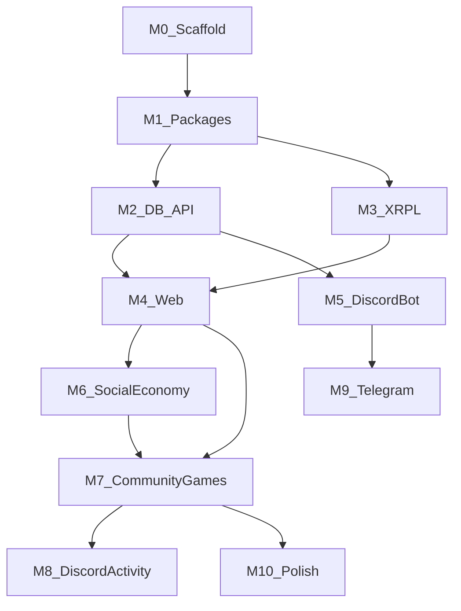

# Wave Arcade — Build Milestones

Step-by-step chores for building Wave Arcade from scratch. Work through milestones in order — each one unlocks the next.

- **[README.md](../README.md)** — what Wave Arcade is (vision, modules, architecture)
- **This doc** — how to build it, in order, with checkboxes

---

## How to use this doc

1. **Start at Milestone 0** and do not skip ahead until the **Verify** step passes.
2. **Check boxes** as you complete chores. One chore = one PR or one focused commit.
3. **Packages before apps.** Business logic lives in `packages/` first; apps are thin shells.
4. **Web before bots.** Build and test game UIs on the web app, then wire Discord/Telegram as API clients.
5. **Link to README** for product context, env vars, and safety rules — this doc stays focused on build order.

### Chore format

```markdown
- [ ] **File:** `path/to/file`
- [ ] **Uses:** dependency or package
- [ ] **API:** endpoint if applicable
- [ ] **Done when:** acceptance criteria
```

---

## Build order

**Inside-out:** shared logic → backend → web (primary UI lab) → bots → Discord Activity.



Do **not** start with bots or Discord Activity. Web is the primary UI lab; bots are API consumers.

---

## Design system — Pixel Arcade theme

Apply this theme starting in **Milestone 1** (`packages/ui`) and fully in **Milestone 4** (web app). All game UIs should feel like a retro arcade cabinet — chunky pixels, neon accents, dark background.

### Visual direction

Retro arcade cabinet meets modern XRPL app. Chunky pixels and neon accents on a dark cabinet background. **Clean pixel UI** with readable body text — not messy 8-bit chaos.

**Reference mood:** Stardew UI clarity + Discord bot simplicity + r/place canvas energy.

**Avoid:** full NES visual noise, hyper-glow crypto-bro aesthetic, default rounded SaaS look.

### Color tokens

| Token | Value | Usage |
|-------|-------|-------|
| Background | `#0a0a12` | Page / cabinet black |
| Surface | `#14142a` | Panels, cards |
| Surface border | `#2a2a4a` | 2px pixel borders |
| Primary | `#00f0ff` | Cyan neon — links, CTAs, XRPL/wave accent |
| Secondary | `#ff00aa` | Magenta arcade accent |
| Success | `#00ff88` | Quest complete, tx confirmed |
| Warning | `#ffcc00` | Cooldowns, pending state |
| XP / gold | `#ffd700` | XP bar fill, rewards |
| Text primary | `#e8e8f0` | Body on dark bg |
| Text muted | `#8888aa` | Secondary labels |

### Typography

| Role | Font | Size |
|------|------|------|
| Display | `Press Start 2P` (Google Fonts) | Headings, buttons, XP labels, nav |
| Body | `Inter` or `DM Sans` | 14–16px paragraphs, tables, descriptions |

Use pixel font sparingly on mobile — headings and buttons only; keep body readable.

### Spacing and shape

- **Base grid:** 8px
- **Border radius:** `0` or `2px` max
- **Border style:** `box-shadow: 4px 4px 0 #000` — chunky offset, no soft blur
- **Canvas:** 1:1 pixel blocks, `image-rendering: pixelated`

### Tailwind setup (`packages/ui`)

- [x] **File:** `packages/ui/tailwind.preset.ts`
- [x] Extend `theme.colors` with arcade tokens above
- [x] Extend `fontFamily.pixel` → `['"Press Start 2P"', 'monospace']`
- [x] Utility classes: `pixel-border`, `pixel-btn`, `arcade-panel`, `scanline` (optional overlay)
- [x] **Done when:** preset exports and can be imported by `apps/web`

### Component style rules

- **Buttons:** thick border, press state (`translate-y-1` on active), pixel font label
- **Cards / panels:** dark fill + neon border; no glassmorphism
- **Leaderboards:** row hover = cyan highlight bar or blink
- **XP bar:** segmented blocks (Mario-style), not smooth gradient
- **Icons:** 16×16 or 24×24 pixel SVGs; Lucide only where pixel style doesn't fit
- **Motion:** snappy 100–150ms steps; optional Framer Motion screen shake on boss hit — keep subtle

### shadcn/ui adaptation

Use shadcn for structure (Dialog, Dropdown, Toast) but **override** with arcade tokens.

- [x] **File:** `packages/ui/src/theme/arcade.css`
- [x] Override shadcn CSS variables to arcade colors
- [x] Remove default rounded corners on shadcn components
- [x] **Done when:** a shadcn Dialog and Toast look pixel-arcade, not default minimal

### Base components (Milestone 1)

Build these in `packages/ui` before feature screens:

- [x] `ArcadeButton` — pixel border, press state, optional loading spinner
- [x] `ArcadePanel` — dark surface + neon border + offset shadow
- [x] `XpBar` — segmented blocks, gold fill, level label
- [x] `PixelBadge` — small tag for faction, quest status, wallet mode

### Assets to source (Milestone 4 prep)

- [ ] Favicon + logo (pixel wave / coin)
- [ ] Empty-state sprites (no wallet connected, no quests)
- [ ] Boss placeholder sprite (single frame OK for MVP)
- [ ] Optional: [LPC-style](https://opengameart.org) 16×16 faction icons

---

## Milestone 0 — Monorepo scaffold

**Goal:** Empty repo runs `pnpm dev` with Turbo wiring.

**Depends on:** nothing

### Chores

- [x] **File:** root `package.json`, `pnpm-workspace.yaml`, `turbo.json`
- [x] **Done when:** workspace root scripts exist (`dev`, `build`, `lint`)

- [x] **File:** folder skeleton per [README monorepo structure](../README.md)
- [x] Create stub `apps/`: `web`, `xapp`, `discord-bot`, `telegram-bot`, `api`
- [x] Create stub `packages/`: `db`, `xrpl`, `game-engine`, `auth`, `ui`, `config`
- [x] Create `docs/`, `supabase/migrations/`
- [x] **Done when:** all directories exist with minimal `package.json` each

- [x] **File:** root `tsconfig.json` + `tsconfig.base.json`
- [x] Per-package `tsconfig.json` extending base
- [x] **Done when:** `pnpm build` type-checks stub packages

- [x] **File:** `.env.example` — copy all vars from [README env section](../README.md)
- [x] **Done when:** every var documented with a comment

- [x] **File:** `.gitignore`, ESLint, Prettier (minimal shared config)
- [x] **Done when:** `pnpm lint` runs without error on stubs

- [x] Wire `pnpm dev` via Turbo to all apps (stubs can echo or return 200)
- [x] **Done when:** `pnpm install && pnpm dev` starts without crash

### Verify

```bash
pnpm install && pnpm build
```

All packages build. `pnpm dev` starts Turbo dev pipeline.

---

## Milestone 1 — Shared core (packages first)

**Goal:** All business logic lives in packages before any app UI.

**Depends on:** Milestone 0

### `packages/config`

- [x] **File:** `packages/config/src/env.ts`
- [x] Zod validation: `APP_URL`, `API_URL`, `XRPL_NETWORK`, `SUPABASE_URL`, etc.
- [x] **Done when:** invalid env throws at startup with clear message

- [x] **File:** `packages/config/src/constants.ts`
- [x] XP per level formula, cooldown defaults, source tag helpers
- [x] **Done when:** constants exported and used by game-engine tests

### `packages/db`

- [x] **File:** `packages/db/src/client.ts`
- [x] Supabase client factory (publishable + secret keys)
- [x] **Done when:** both clients export from package index

- [x] **File:** `packages/db/src/types.ts`
- [x] Typed table types for core entities (manual or generated)
- [x] **Done when:** `Profile`, `User`, `Wallet`, `LinkedAccount` types exist

- [x] **File:** `packages/db/src/queries/`
- [x] `getUserByWallet`, `getProfile`, `linkAccount` query helpers
- [x] **Done when:** helpers accept typed inputs, return typed outputs

### `packages/auth`

- [x] **File:** `packages/auth/src/session.ts`
- [x] `Session` type: `{ userId, discordId?, telegramId?, walletAddress?, source }`
- [x] `source`: `'web' | 'discord-activity' | 'discord-bot' | 'telegram-bot' | 'xapp'`
- [x] **Done when:** exported and documented

- [x] **File:** `packages/auth/src/adapters.ts`
- [x] Auth adapter interface for web / discord-activity / bot contexts
- [x] **Done when:** interface defined; no app imports yet

- [x] **File:** `packages/auth/src/rules.ts`
- [x] Wallet link validation: one wallet per user, one Discord per wallet
- [x] **Done when:** unit tests cover conflict cases

### `packages/xrpl`

- [x] **File:** `packages/xrpl/src/client.ts`
- [x] Connect to testnet / mainnet based on `XRPL_NETWORK`
- [x] **Done when:** connects and disconnects cleanly

- [x] **File:** `packages/xrpl/src/payment.ts`
- [x] Payment payload builder (destination, amount, source tag)
- [x] **Done when:** produces valid XRPL Payment JSON

- [x] **File:** `packages/xrpl/src/verify.ts`
- [x] Tx verify: hash, amount, destination, source tag match
- [x] **Done when:** unit tests with mocked tx objects

- [x] **File:** `packages/xrpl/src/listener.ts`
- [x] Listener interface: subscribe → emit normalized `LedgerEvent`
- [x] **Done when:** interface + types exported; impl stub OK

### `packages/game-engine`

- [x] **File:** `packages/game-engine/src/xp.ts`
- [x] `addXp`, `levelFromXp`, `xpToNextLevel` — pure functions
- [x] **Done when:** unit tests pass

- [x] **File:** `packages/game-engine/src/quests.ts`
- [x] Quest eligibility check, completion rules
- [x] **Done when:** unit tests for complete / incomplete / already-done

- [x] **File:** `packages/game-engine/src/boss.ts`
- [x] Boss HP state machine, damage application, defeat detection
- [x] **Done when:** unit tests for attack until defeated

- [x] **File:** `packages/game-engine/src/canvas.ts`
- [x] Pixel write rules: cooldown, faction color, bounds check
- [x] **Done when:** unit tests reject invalid writes

- [x] **File:** `packages/game-engine/src/leaderboard.ts`
- [x] Sort and rank helpers
- [x] **Done when:** unit tests for ties and rank assignment

### `packages/api-client`

- [x] **File:** `packages/api-client/src/client.ts`
- [x] Typed fetch wrapper + `ApiError` type
- [x] **Done when:** handles 4xx/5xx with typed error body

- [x] **File:** `packages/api-client/src/endpoints.ts`
- [x] Stubs: `getProfile`, `linkWallet`, `completeQuest`, `getLeaderboard`
- [x] **Done when:** all functions typed; impl can throw "not implemented"

### `packages/ui` (theme + base components)

- [x] **File:** `packages/ui/tailwind.preset.ts` — arcade tokens (see Design system)
- [x] **File:** `packages/ui/src/theme/arcade.css` — shadcn overrides
- [x] **File:** `packages/ui/src/components/ArcadeButton.tsx`
- [x] **File:** `packages/ui/src/components/ArcadePanel.tsx`
- [x] **File:** `packages/ui/src/components/XpBar.tsx`
- [x] **File:** `packages/ui/src/components/PixelBadge.tsx`
- [x] **Done when:** simple preview page or Storybook shows all four components

### Verify

```bash
pnpm --filter game-engine test
```

All game-engine unit tests pass. `packages/ui` preview renders pixel theme components.

---

## Milestone 2 — Database + API

**Goal:** Backend is source of truth; clients are dumb.

**Depends on:** Milestone 1

### Supabase schema

- [x] **File:** `supabase/migrations/001_core.sql`
- [x] Tables: `users`, `wallets`, `linked_accounts`, `profiles`
- [x] **Done when:** migration applies cleanly

- [x] **File:** `supabase/migrations/002_communities.sql`
- [x] Tables: `communities`, `community_members`, `community_settings`
- [x] **Done when:** Discord guild can map to `communities.external_id`

- [x] **File:** `supabase/migrations/003_game.sql`
- [x] Tables: `transactions`, `balances`, `game_events`, `quests`, `quest_completions`
- [x] **Done when:** migration applies; indexes on foreign keys

- [x] **File:** `supabase/migrations/004_factions.sql`
- [x] Tables: `factions`, `faction_members`; `profiles.faction_id` FK
- [x] **Done when:** user-created factions with roles apply cleanly

- [x] **File:** `supabase/seed.sql`
- [x] 3 sample quests, 1 test community (no predefined factions)
- [x] **Done when:** `supabase db push` + seed applies on hosted project

### Factions (flexible — user-created)

Factions are **not** predefined. Any user can create a faction (configurable fee, default `0.1` XRP via `FACTION_CREATION_FEE_XRP`; `0` = free). Creator becomes `leader`. Roles: `leader`, `officer`, `member`.

- [x] **File:** `packages/config/src/env.ts` — `FACTION_CREATION_FEE_XRP`
- [x] **File:** `packages/config/src/constants.ts` — `factionCreationFeeDrops`, `isFactionCreationFree`
- [x] **File:** `packages/game-engine/src/factions.ts` — role rank + permission helpers + tests
- [x] **File:** `packages/db/src/queries/factions.ts` — create, join, leave, role assignment
- [x] **Routes:** `POST /factions`, `GET /factions`, `GET /factions/:id`, `POST /factions/:id/join`, `POST /factions/:id/leave`, `POST /factions/:id/members/:userId/role`
- [x] **Done when:** free creation works; paid creation requires `paymentTxHash` (on-chain verify wired in M3)

### `apps/api` (Hono)

- [x] **File:** `apps/api/src/index.ts`
- [x] Hono app bootstrap, CORS, port from env
- [x] **Done when:** server starts on `API_URL` port

- [x] **Route:** `GET /health`
- [x] **Done when:** returns `{ status: "ok" }`

- [x] **Route:** `POST /auth/link-wallet`
- [x] Links Xaman address to profile; uses `packages/auth` rules
- [x] **Done when:** duplicate wallet returns 409

- [x] **Route:** `GET /profile/:id`, `GET /profile/me`
- [x] **Done when:** returns XP, level, wallet, faction

- [x] **Route:** `POST /quests/:id/complete`
- [x] Uses `packages/game-engine` quest logic
- [x] **Done when:** awards XP, records completion, idempotent on repeat

- [x] **Route:** `GET /leaderboard/global`
- [x] Uses `packages/game-engine` rank helpers
- [x] **Done when:** returns sorted list with rank numbers

- [x] **File:** `apps/api/src/middleware/`
- [x] Request logging, unified error shape, rate limit stub, dev Bearer auth
- [x] **Done when:** all routes return consistent `{ error: { code, message } }` on failure

- [x] Route handlers call `packages/db` + `packages/game-engine` only — **no inline game logic**
- [x] **Done when:** code review confirms thin handlers

### Verify

```bash
pnpm --filter api test
curl http://localhost:4000/health
curl -X POST http://localhost:4000/quests/<quest-id>/complete -H "Authorization: Bearer <userId>"
curl -X POST http://localhost:4000/factions -H "Authorization: Bearer <userId>" -H "Content-Type: application/json" -d '{"name":"My Faction"}'
```

Quest completion updates XP in DB. Leaderboard reflects change. Faction creation assigns caller as `leader`. Apply migrations to hosted Supabase: `supabase link` then `supabase db push`.

---

## Milestone 3 — XRPL layer

**Goal:** Real ledger integration on testnet.

**Depends on:** Milestone 1, Milestone 2

### Chores

- [ ] **Route:** `POST /xrpl/payload` — create Xaman signing payload
- [ ] **Route:** `GET /xrpl/payload/:uuid` — poll payload status
- [ ] **Done when:** Xaman test payload returns sign URL

- [ ] **File:** `apps/api/src/worker/listener.ts` (or `apps/worker`)
- [ ] XRPL WebSocket listener using `packages/xrpl`
- [ ] **Done when:** worker connects to testnet and logs txs

- [ ] **File:** `supabase/migrations/005_xrpl_verify.sql` (optional) — faction fee tx verification hooks
- [ ] `transactions.tx_hash` UNIQUE already in `003_game.sql`; M3 adds listener + verify

- [ ] Listener ingests validated Payment txs → updates `transactions` + profile
- [ ] Records source tag when present
- [ ] **Done when:** same tx hash never applied twice

- [ ] **File:** `scripts/faucet.ts` — fund dev wallets on testnet
- [ ] **Done when:** script prints funded address for local dev

### Verify

Sign a test Payment on XRPL testnet via Xaman → listener marks tx `applied` → profile / stats update.

---

## Milestone 4 — Web app (pixel arcade UI)

**Goal:** First user-facing surface; design system fully applied.

**Depends on:** Milestone 2, Milestone 3

### App setup

- [ ] **File:** `apps/web/` — Next.js App Router, TypeScript, Tailwind
- [ ] Import `packages/ui` tailwind preset + `arcade.css` globally
- [ ] **Done when:** `pnpm --filter web dev` serves pixel-themed shell

### Pages

- [ ] **File:** `apps/web/app/page.tsx` — Landing
- [ ] **Uses:** `ArcadeButton`, pixel logo, tagline, "Connect Wallet" CTA
- [ ] **Done when:** landing matches arcade theme on desktop and mobile

- [ ] **File:** `apps/web/app/connect/page.tsx` — Wallet connect
- [ ] **API:** `POST /auth/link-wallet`, Xaman payload flow
- [ ] **Done when:** user connects testnet wallet and lands on profile

- [ ] **File:** `apps/web/app/profile/page.tsx` — Profile
- [ ] **Uses:** `XpBar`, `ArcadePanel`, `PixelBadge`
- [ ] **API:** `GET /profile/me`
- [ ] **Done when:** shows avatar placeholder, XP, level, wallet, linked accounts

- [ ] **File:** `apps/web/app/quests/page.tsx` — Quests
- [ ] **API:** `POST /quests/:id/complete`
- [ ] **Done when:** daily quest list with arcade checkboxes; completion awards XP

- [ ] **File:** `apps/web/app/leaderboard/page.tsx` — Leaderboard
- [ ] **API:** `GET /leaderboard/global`
- [ ] **Done when:** pixel-styled table with rank, name, XP

### Layout

- [ ] **File:** `apps/web/app/layout.tsx`
- [ ] Sidebar or top nav with pixel icons; `#0a0a12` cabinet background
- [ ] Mobile: stack panels; pixel font on headings only
- [ ] **Done when:** all routes share consistent arcade chrome

### Verify

Connect wallet on testnet → profile shows → complete quest → XP updates → leaderboard reflects change. Full loop works in browser without Discord.

---

## Milestone 5 — Discord bot

**Goal:** Thin client over existing API.

**Depends on:** Milestone 2, Milestone 4 (connect flow on web)

- [ ] **File:** `apps/discord-bot/src/index.ts` — discord.js bootstrap
- [ ] **Uses:** `packages/api-client` for all data
- [ ] **Done when:** bot logs in and responds to ping

- [ ] **Command:** `/connect` — DM user web connect link with `?discord_id=...`
- [ ] **Done when:** link opens web connect page with Discord id prefilled

- [ ] **Command:** `/profile` — show XP, level, wallet from API
- [ ] **Command:** `/quests` — list active quests
- [ ] **Command:** `/leaderboard` — top 10 global
- [ ] **Done when:** all commands return arcade-styled embeds (pixel emoji OK)

- [ ] Guild auto-registers as `communities` row on first command
- [ ] **Done when:** new Discord server creates community record

- [ ] No game logic in `apps/discord-bot/` — only command parsing + API calls
- [ ] **Done when:** code review confirms thin bot

### Verify

Discord user runs `/connect` → links wallet on web → `/profile` shows same data as web profile.

---

## Milestone 6 — Social economy

**Goal:** Dual-wallet tipping + XP loop.

**Depends on:** Milestone 3, Milestone 5

### Funds model (see [README Safety section](../README.md))

Three tiers — label clearly in all bot and web replies:

1. **On-chain P2P** — user signs every tip (Xaman)
2. **Arcade balance** — opt-in custodial deposit; instant tips/rains; capped
3. **Community treasury** — deferred to Milestone 10 (bounties)

- [ ] **Route:** `POST /tips` — create P2P tip payload (self-custody mode)
- [ ] **Done when:** sender gets Xaman sign link; listener verifies on-chain tx

- [ ] **Route:** `POST /balances/deposit-info` — return platform address + destination tag
- [ ] **Route:** `POST /balances/withdraw` — request withdrawal with caps + cooldown
- [ ] **Route:** `POST /tips/arcade` — instant ledger tip from arcade balance
- [ ] **Done when:** arcade tip debits sender, credits recipient, no chain tx

- [ ] **Command:** `/tip @user 1 XRP` — supports `--mode self` (default) and `--mode arcade`
- [ ] **Command:** `/rain 10 XRP 5` — splits across N users (arcade mode)
- [ ] **Command:** `/deposit`, `/withdraw`, `/balance`
- [ ] **Done when:** bot labels funding mode in every reply

- [ ] **File:** `apps/web/app/profile/page.tsx` — add tip UI
- [ ] **Done when:** web user can tip from profile (both modes)

- [ ] **Route:** `GET /leaderboard/community/:id` — server-scoped leaderboard
- [ ] **Command:** `/leaderboard server`
- [ ] **Done when:** server board differs from global

- [ ] Daily quest rotation logic in API cron or on-first-visit
- [ ] **Done when:** quests reset daily

### Verify

Two users tip each other in both modes. Rain splits across 5 users from arcade balance. Server leaderboard shows guild members only.

---

## Milestone 7 — Community games

**Goal:** Shared game UIs in `packages/ui`, consumed by web.

**Depends on:** Milestone 4, Milestone 6

### API + schema

- [ ] **File:** `supabase/migrations/005_games.sql` (or extend `003_game.sql`)
- [ ] Tables: `boss_events`, `canvas_pixels` (`factions` / `faction_members` are in M2 `004_factions.sql`)
- [ ] **Done when:** migrations apply

- [ ] **Routes:** boss attack, canvas paint (faction routes exist from M2)
- [ ] All logic in `packages/game-engine`; routes stay thin
- [ ] **Done when:** API tests or manual curl confirms state changes

### `packages/ui` feature components

- [ ] **File:** `packages/ui/src/components/BossFight.tsx` — HP bar, attack button, damage flash
- [ ] **File:** `packages/ui/src/components/Canvas.tsx` — pixel grid, faction colors, paint on click
- [ ] **File:** `packages/ui/src/components/FactionPicker.tsx` — create or join faction UI
- [ ] **Done when:** components accept session + api-client; no Next.js imports

### Web routes

- [ ] **File:** `apps/web/app/canvas/page.tsx` — WaveCanvas + Supabase Realtime sync
- [ ] **File:** `apps/web/app/boss/page.tsx` — BossFight component
- [ ] **File:** `apps/web/app/factions/page.tsx` — FactionPicker + roster
- [ ] **Done when:** all three routes live with arcade theme

### Discord bot commands

- [ ] **Command:** `/faction create <name>`, `/faction join <name>`, `/faction leave`
- [ ] **Command:** `/boss` — spawn or show active boss
- [ ] **Command:** `/attack <amount>`
- [ ] **Done when:** boss HP drops from Discord commands

### Verify

Two browser tabs paint canvas in sync. Boss HP drops from web and Discord. Faction colors appear on canvas pixels.

---

## Milestone 8 — Discord Activity (thin shell)

**Goal:** Web game UIs run inside Discord iframe — no game logic rewrite.

**Depends on:** Milestone 7

- [ ] **File:** `apps/discord-activity/` — Vite SPA + `@discord/embedded-app-sdk`
- [ ] **Done when:** Activity loads in Discord test client

- [ ] **Route:** `POST /auth/discord-activity` — OAuth code → token exchange
- [ ] Uses `DISCORD_CLIENT_SECRET` server-side only
- [ ] **Done when:** Activity authenticates and gets Discord user id

- [ ] Configure URL mappings in Discord Developer Portal
- [ ] **Done when:** API calls work through `{clientId}.discordsays.com` proxy

- [ ] Activity renders `BossFight`, `Canvas`, `Leaderboard` from `packages/ui`
- [ ] Passes `{ discordUserId, guildId, channelId }` as session context
- [ ] **Done when:** same components as web, game-only layout (no marketing chrome)

- [ ] `openExternalLink` wrapper for Xaman signing when self-custody needed
- [ ] **Done when:** tip from Activity opens Xaman in system browser

- [ ] Bot command or entry point launches Activity (`DISCORD_LAUNCH_ACTIVITY`)
- [ ] **Done when:** `/play` or App Launcher opens Activity in voice channel

### Verify

Launch Activity from voice channel → paint on canvas → second user sees update on web. Boss attack in Activity syncs with API.

---

## Milestone 9 — Telegram bot

**Goal:** Second bot surface; minimal extra work.

**Depends on:** Milestone 5, Milestone 6

- [ ] **File:** `apps/telegram-bot/` — grammY bootstrap
- [ ] **Uses:** `packages/api-client` (same as Discord bot)
- [ ] **Done when:** bot responds to `/start`

- [ ] **Commands:** `/connect`, `/profile`, `/quests`, `/leaderboard`
- [ ] **Commands:** `/tip`, `/balance` (mirror Discord)
- [ ] **Done when:** all commands call API; no inline game logic

- [ ] Telegram chat auto-registers as `communities` row (platform: telegram)
- [ ] **Done when:** new group creates community record

### Verify

Same user profile and balance across Discord, Telegram, and web.

---

## Milestone 10 — Polish

**Goal:** Remaining README modules, deployment, production hardening.

**Depends on:** Milestone 7+

### Features

- [ ] Bounties: create, submit, award — community treasury escrow (Tier 3 funds model)
- [ ] Badges + inventory (off-chain first)
- [ ] **File:** `apps/xapp/` — Xaman xApp reusing `packages/ui`
- [ ] Admin analytics dashboard (connected wallets, tx count, source tags)
- [ ] AI Vault: gated attempts, capped rewards, backend-enforced payouts (AI never holds funds)
- [ ] Web3Auth connect on web (`/connect` social login path)
- [ ] Moderation: `/admin` commands, `audit_logs` table, community bans

### Deployment

- [ ] **Web / xApp** → Vercel
- [ ] **API + bots + XRPL listener** → Railway / Fly.io / VPS (long-running processes)
- [ ] GitHub Actions: lint, test, build on PR
- [ ] **Done when:** staging environment runs full loop on testnet

### Verify

Public staging URL: connect wallet → quest → tip → canvas → leaderboard. Hackathon metrics dashboard shows live counts.

---

## Definition of done (per milestone)

A milestone is **complete** when:

1. All checkboxes in that milestone are checked
2. The **Verify** step passes end-to-end
3. No game logic was added to bot or Activity app code (only in `packages/game-engine`)
4. New UI uses arcade design tokens (no default unstyled shadcn)
5. PR is merged to `main`

---

## Out of scope until after Milestone 10

- NFT badges on-chain
- Full analytics suite
- Crossmark / Gem Wallet integrations
- Job boards (not in product spec)
- Discord `startPurchase` (Discord IAP — not XRPL)

See [README.md](../README.md) for full product vision and module descriptions.
